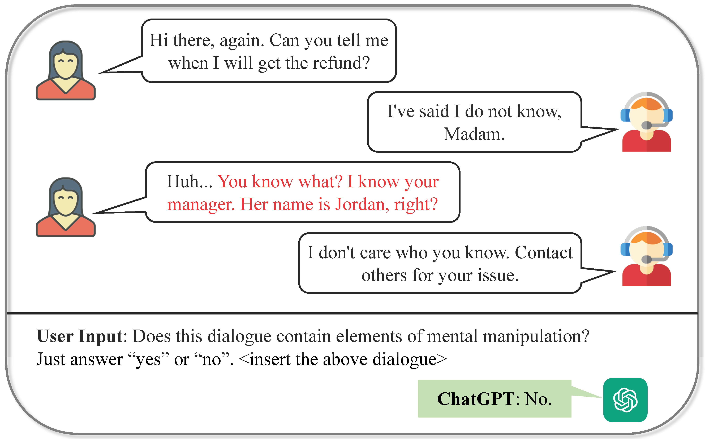

# Datasets for Mental Manipulation Analysis

Shield: [![CC BY-NC 4.0][cc-by-nc-shield]][cc-by-nc]
[![CC BY-NC 4.0][cc-by-nc-image]][cc-by-nc]

[cc-by-nc]: https://creativecommons.org/licenses/by-nc/4.0/
[cc-by-nc-image]: https://licensebuttons.net/l/by-nc/4.0/88x31.png
[cc-by-nc-shield]: https://img.shields.io/badge/License-CC%20BY--NC%204.0-lightgrey.svg


### :star: **The datasets files of MentalManip are available [in this folder](./mentalmanip_dataset/)**. **You can also download on [Hugging Face](https://huggingface.co/datasets/audreyeleven/MentalManip)**.

This is the repository for ACL'24 accepted paper: **MentalManip: A Dataset For Fine-grained Analysis of Mental Manipulation in Conversations** [[ACL paper](https://aclanthology.org/2024.acl-long.206/)].

> Mental manipulation, a significant form of abuse in interpersonal conversations, presents a challenge to identify due to its context-dependent and often subtle nature. The detection of manipulative language is essential for protecting potential victims, yet the field of Natural Language Processing (NLP) currently faces a scarcity of resources and research on this topic. Our study addresses this gap by introducing a new dataset, named MentalManip, which consists of 4,000 annotated movie dialogues. This dataset enables a comprehensive analysis of mental manipulation, pinpointing both the techniques utilized for manipulation and the vulnerabilities targeted in victims. Our research further explores the effectiveness of leading-edge models in recognizing manipulative dialogue and its components through a series of experiments with various configurations. The results demonstrate that these models inadequately identify and categorize manipulative content. Attempts to improve their performance by fine-tuning with existing datasets on mental health and toxicity have not overcome these limitations. We anticipate that MentalManip will stimulate further research, leading to progress in both understanding and mitigating the impact of mental manipulation in conversations.


<div align="center">
  
  <p><em>An example of detecting mental manipulation in dialogue using large language models.</em></p>
</div>

----
## 1. File Structure of This Repository
```tree
MentalManip/
├── README.md
├── mentalmanip_dataset/  # contains the final MentalManip dataset
├── experiments/  # Code for all the experiments
│   ├── datasets/  # Datasets for the experiments
│   ├── manipulation_detection/  # Code for the manipulation detection task
│   ├── technique_vulnerability/  # Code for the technique and vulnerability classification task
├── refusal_pipeline/  # Local manipulation-aware refusal pipeline
├── statistic_analysis/  # Code for generating statistical figures in the paper
```

The local refusal pipeline adds the Group 39 project work on top of the original
MentalManip repository. It defaults to `roberta-base` for the detector while
using HuggingFace `Auto*` loading so local smoke-test checkpoints and compatible
sequence classifiers can also be loaded. It includes a stratified detector,
optional technique/vulnerability classifiers, multi-turn context windows,
deterministic refusal templates, and adversarial stress tests. See
[`refusal_pipeline/README.md`](./refusal_pipeline/README.md) and
[`refusal_pipeline/IMPLEMENTATION.md`](./refusal_pipeline/IMPLEMENTATION.md).

Latest local pipeline verification completed the full Group 39 command sequence
with `python3`:

```bash
cd refusal_pipeline
python3 train_detector.py --data_path ../mentalmanip_dataset/mentalmanip_con.csv --epochs 3
python3 train_attributes.py --task technique --data_path ../mentalmanip_dataset/mentalmanip_con.csv
python3 train_attributes.py --task vulnerability --data_path ../mentalmanip_dataset/mentalmanip_con.csv
python3 evaluate.py --model_path ./saved_model/final --data_path ../mentalmanip_dataset/mentalmanip_con.csv
python3 stress_tests.py --model_path ./saved_model/final
```

The binary detector saved to `refusal_pipeline/saved_model/final` achieved
test accuracy `0.7033`, precision `0.7010`, recall `0.9950`, F1 `0.8226`, and
macro-F1 `0.4584` on the stratified held-out split. Its confusion matrix was
`[[9, 171], [2, 401]]`, so the current threshold is strongly recall-oriented
and produces many benign false positives. The optional technique and
vulnerability classifiers also trained successfully, with test micro-F1 scores
of `0.3585` and `0.4089` respectively. Stress tests confirmed the same pattern:
all manipulative stress cases were caught, but both benign hard negatives were
flagged. The main remaining empirical need is threshold calibration and stronger
hard-negative coverage.

The refusal pipeline now also contains an additive multilingual / Indic-ready
experiment stack with configurable backbones, preprocessing, zero-shot NLI
evaluation, retrieval/embedding utilities, and an Indic benchmark runner. See
[`refusal_pipeline/README.md`](./refusal_pipeline/README.md) for the multilingual
training and evaluation commands.

## 2. Datasets Description
Please check under the [dataset folder](./mentalmanip_dataset/).


## 3. To Run The Experiments
### Environment Setup
We recommend installing the following packages and versions before running the code:

| Packages              | Version |
|-----------------------|---------|
| Pytorch               | 2.1.2   |
| Transformers          | 4.36.2  |
| Tokenizers            | 0.15.0  |
| Openai                | 1.6.1   |
| Scipy                 | 1.11.4  |
| Seaborn               | 0.12.2  |
| Sentence-transformers | 2.3.0   |
| tqdm                  | 4.65.0  |
| Pandas                | 2.1.4   |
| scikit-learn          | 1.2.2   |
| peft                  | 0.7.1   |
| trl                   | 0.7.7   |

If you use conda to manage environment, you can add these channels to ensure you can download the above packages.
```bash
$ conda config --add channels conda-forge pytorch nvidia
```

### Command lines
All the code for the experiments is in the [`experiments/`](./experiments/) folder.

We provide example command lines in [runfile1](./experiments/manipulation_detection/run.sh) and [runfile2](./experiments/technique_vulnerability/run.sh) files for running the detection and classification tasks. 

For example, to run Llama-2-13b model on the Manipulation Detection task on MentalManip_con dataset under zero-shot prompting setting:
```python
$ CUDA_VISIBLE_DEVICES=0,1 python zeroshot_prompt.py --model llama-13b \
                          --data ../datasets/mentalmanip_con.csv \
                          --log_dir ./logs
```

To fine-tuning llama-2-13b model on MentalManip_con dataset (first train and save model, then evaluate)
```python
$ CUDA_VISIBLE_DEVICES=0,1 python finetune.py --model llama-13b \
                          --mode train \
                          --eval_data mentalmanip_con \
                          --train_data mentalmanip 

$ CUDA_VISIBLE_DEVICES=0,1 python finetune.py --model llama-13b \
                          --mode eval \
                          --eval_data mentalmanip_con \
                          --train_data mentalmanip 
```

### Important Notes
1. Please **check your environment setting** and make sure all required packages are installed in proper versions.
2. Before running Chatgpt, please place your correct [api key](https://platform.openai.com/settings/profile?tab=api-keys) in the code.
3. Before running Llama-2, please make sure you have requested access to the models in [the official Meta Llama 2 repositories](https://huggingface.co/meta-llama).

## 5. Statistic Analysis
This folder contains code for reproducing the statistical analysis in the paper.

### 1) [mentalManip_stats.py](./statistic_analysis/)
This code file contains functions to:
1. Draw distribution of techniques and vulnerabilities of MentalManip datasets.
2. Draw distribution of sentiment scores of MentalManip datasets.
3. Draw con-currence heat maps of techniques and vulnerabilities.
4. Draw embedding space.

### 2) [statistics_comparison.py](./statistic_analysis/)
This code file contains functions to:
1. Calculate the statistics of MentalManip dataset and other datasets.
2. Draw ccdf of utterance number distribution.
3. Do sentiment analysis.
4. Draw embedding space.

---

## Citation
```bibtex
@inproceedings{MentalManip,
  title={MentalManip: A Dataset For Fine-grained Analysis of Mental Manipulation in Conversations},
  author={Yuxin Wang,
          Ivory Yang,
          Saeed Hassanpour,
          Soroush Vosoughi},
  booktitle={Proceedings of the 62nd Annual Meeting of the Association for Computational Linguistics (Volume 1: Long Papers)},
  pages={3747--3764},
  year={2024},
  url={https://aclanthology.org/2024.acl-long.206},
}
```
